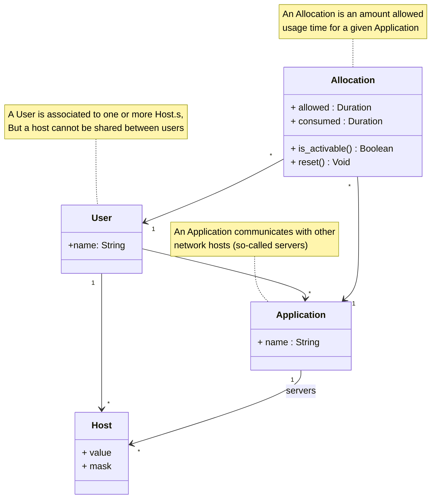

# AppWall

Application helping at timeboxing application usage.

## Scenario 
An ***User*** has **Application** installed on at least one **Host**. Each **Application** communicates with external **Host[]** to operate (its so-called *servers*).

By default, no network communication is allowed, so that **User** can not use any **Application**.

Another **User** with administrative permission can create **Allocation**. An **Allocation** can target at least one **Application** and one **User**. When **Allocation** is activable, **User** can activate it for some time. During _activation_, related **Application.s** can communicate with internet and are fully useable. It is possible to query an **Allocation** to see how long it has been activated.

_Allocations_ example:
* **yatabe.com** is useable each weekday, _up to_ two hours
* **furtday** is useable saturday and sunday, _up to_ three hours each day
* **furtday** is useable wednesday afternoon, _up to_ two hours
* **My school agenda** is always useable
* **Dictionnary.com** is always useable
* **Mathematics lessons** is always useable

**User** is responsible in usage of its **Allocation**. He/she uses AppWall to start and stop activation of an **Allocation**. When maximum activation duration is reached for a given time interval, **User** has to wait for next activation window.

## Technical

AppWall is able to allow or deny network communication between, one one hand, **User** **Host** 
and in another hand **Application** and its external **Host** (so-called "servers").

## Domain class diagram

